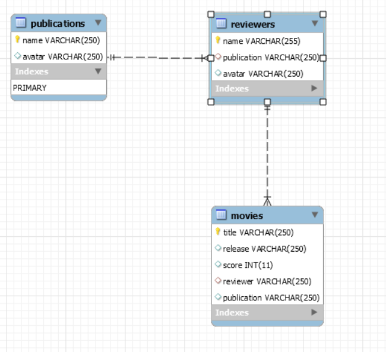

# movie-analyst-api
API for the movie analyst application of the devops ramp up

In order to deploy this application you will need to deploy a mysql database, and build the following schema:



## Development

You can create a local MySQL database using docker with the following commands:

```bash
# Run a MySQL container
docker run --name mysql -p 3306:3306 -e MYSQL_ROOT_PASSWORD=password -e MYSQL_DATABASE=movie_db -d mysql:9.3.0-oracle

# Load the initial schema
docker exec -i mysql mysql -u root --password=password movie_db < ../db/init.sql

# Use this command if you need to connect to the database
# Probably not needed if you are using the server
docker exec -it mysql mysql -u root -p movie_db
```

To run the application in development mode, you can use the following command:

```bash
npm i

npm run seed # Seeds the database with some initial data

npm start # Starts the server
```

## Attributions
Application developed based on this post https://scotch.io/tutorials/building-and-securing-a-modern-backend-api